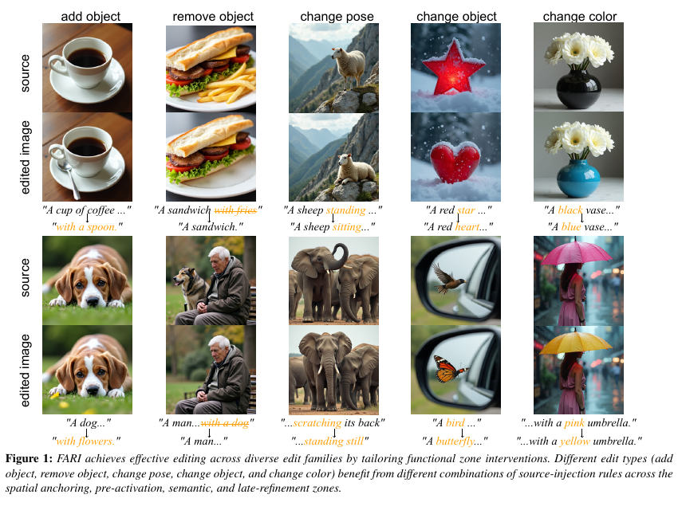
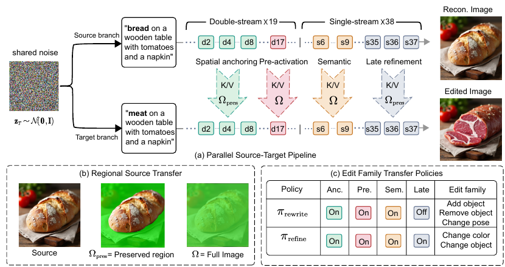
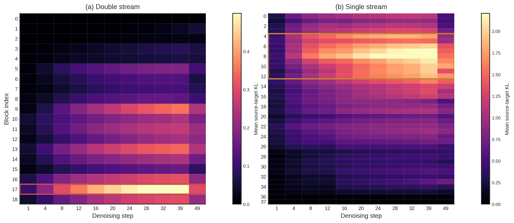
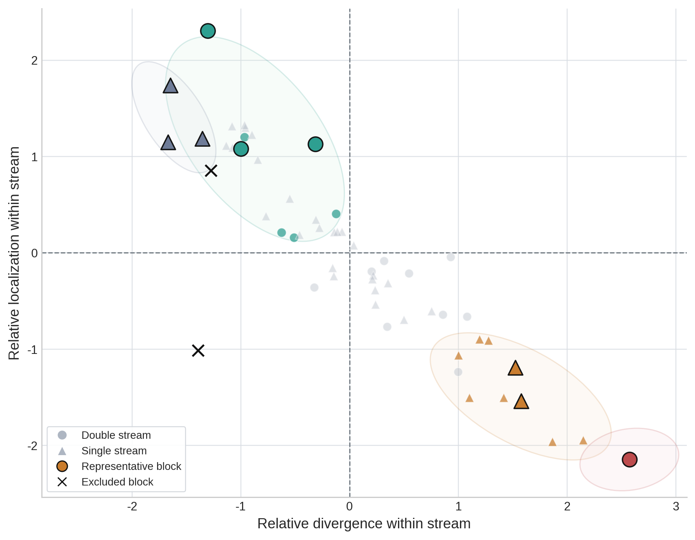
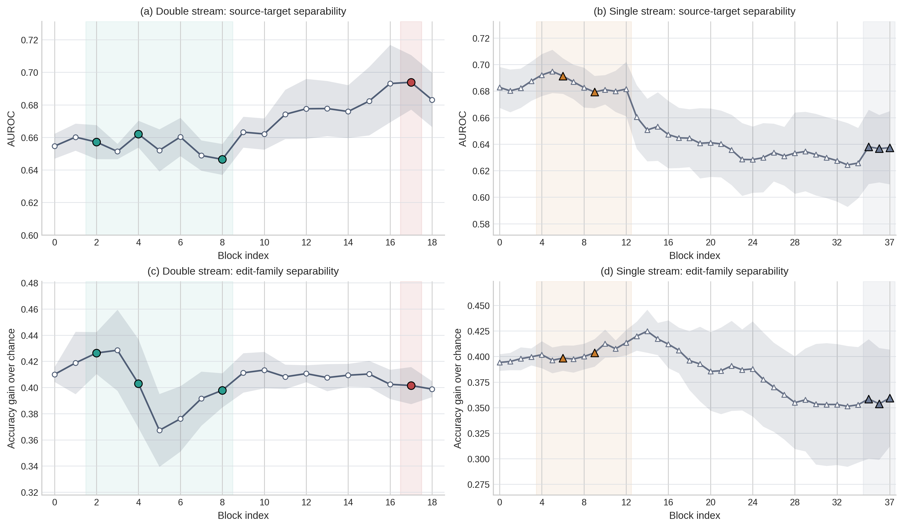

# Function-Aware Regional Injection for Training-Free Image Editing

**Siyuan Xing, Xiao-Ming Fu**

Accepted to **Pacific Graphics 2026**, to appear in *Computer Graphics Forum*.

Paper link coming soon.



FARI is a training-free editing method for FLUX.1-dev. It diagnoses four functional MMDiT zones and applies source K/V transfer with a region rule suited to each zone. Both branches start from the same noise and are denoised synchronously under source and target prompts.

## Method at a glance

| Functional zone | Blocks | Source-transfer region |
|---|---:|---|
| Spatial anchoring | d2, d4, d8 | Preserved region |
| Pre-activation | d17 | Full image |
| Semantic | s6, s9 | Full image |
| Late refinement | s35, s36, s37 | Preserved region |

The `rewrite` policy activates the first three zones for Add Object, Remove Object, and Change Pose. The `refine` policy also activates Late Refinement for Change Color and Change Object.





## Installation

FLUX.1-dev is a gated external model. Request access and accept its license on Hugging Face before running FARI. Model weights are never distributed by this repository.

```bash
conda env create -f environment.yml
conda activate fari
export HF_TOKEN=your_huggingface_token
```

The tested environment uses Python 3.11, PyTorch 2.4.1, CUDA 12.1, and diffusers 0.30.0. A CUDA GPU is required for full-resolution inference; `--cpu-offload` lowers VRAM use at the cost of runtime.

## Quick start

FARI implements the paper's prompt-to-prompt shared-noise setting. The input is a source prompt and a target prompt, not an arbitrary real source image.

```bash
fari edit \
  --source-prompt "A white cup on a wooden table." \
  --target-prompt "A blue cup on a wooden table." \
  --family change_color \
  --preserve-mask examples/preserve_mask.png \
  --seed 42 \
  --output outputs/cup_color
```

The preserve mask is white in regions that should retain source features and black in the editable region. The command writes `source.png`, `edited.png`, `preserve_mask.png`, and `metadata.json`.

To construct a mask automatically, install [Grounded-Segment-Anything](https://github.com/IDEA-Research/Grounded-Segment-Anything) separately and provide its repository, config, and checkpoint paths. You may pass `--grounding-query` directly or set `DEEPSEEK_API_KEY` to infer it from the prompt pair. No third-party repository or checkpoint is vendored here.

## Mechanism diagnostics

FARI exposes the three signals used in the paper:

1. **Attention Divergence** computes directional `D_KL(H_source || H_target)` for changed-token attention at every selected block and denoising step.
2. **Spatial Localization** measures IoU between binarized edit-token attention and the final visible edit region, using the paper's pixel threshold `0.12` and adaptive empty-mask fallback.
3. **Hidden-State Separability** fits a standardized linear logistic probe to changed-token hidden states with grouped cross-validation.

```bash
fari diagnose \
  --source-prompt "A pitcher on a table." \
  --target-prompt "A teapot on a table." \
  --source-changed-tokens 2 \
  --target-changed-tokens 2,3 \
  --capture-steps 1,4,8,12,16,20,24,28,32,39,49 \
  --output outputs/pitcher_to_teapot
```

The changed-token arguments are tokenizer indices. The command stores raw tensors in `diagnostics.pt`, final images, the final edit mask, and a JSON block-step summary. The reusable metric functions are available under `fari.diagnostics`.

After capturing multiple prompt pairs, fit the grouped linear probe with:

```bash
fari diagnose \
  --probe-artifacts run1/diagnostics.pt,run2/diagnostics.pt,run3/diagnostics.pt \
  --output outputs/hidden_probe
```





## Controlled Edit construction protocol

This repository releases the construction code and exact protocol, not the frozen benchmark annotations or COCO images.

```bash
fari build-data \
  --coco-captions /path/to/captions_train2017.json \
  --output datasets/controlled_edit \
  --seeds-only
```

Remove `--seeds-only` and set `DEEPSEEK_API_KEY` to generate candidate prompt pairs with `deepseek-chat`, temperature `0.3`. The script implements the ten-category lexicon, 4–12 token filter, ambiguity exclusions, 25 seeds per category, and five edit families described in the supplementary material.

Because the frozen paper annotations are not distributed, rerunning the LLM reconstructs the protocol but is not guaranteed to reproduce the paper benchmark sample-for-sample.

## External repositories

FARI does not vendor comparison methods or segmentation systems. Use their official releases:

- [FLUX](https://github.com/black-forest-labs/flux)
- [Grounded-Segment-Anything](https://github.com/IDEA-Research/Grounded-Segment-Anything)
- [Stable Flow](https://omriavrahami.com/stable-flow/)
- [Exploring-MMDiT](https://github.com/SNU-VGILab/exploring-mmdit)
- [KV-Edit](https://github.com/Xilluill/KV-Edit)
- [HeadRouter](https://github.com/ICTMCG/HeadRouter)
- [FreeFlux](https://wtybest.github.io/projects/FreeFlux/)
- [SynPS](https://github.com/zhuochen02/SynPS)

## Evaluation

`fari evaluate` consumes JSONL rows containing `source_image_path`, `edited_image_path`, and optional `preserve_mask_path`. Paths may be relative to the manifest.

```bash
fari evaluate --manifest outputs/generations.jsonl --output outputs/metrics.jsonl
```

The public evaluator reports global and preserved-region pixel metrics and SSIM. Add `--clip-model`, `--dino-model`, and/or `--lpips` to compute CLIPtxt/CLIPimg/CLIPdir, DINO similarity, and LPIPS. Comparison methods should be run from their official repositories and converted to the same manifest format.

## Repository layout

```text
fari/editing/       final FARI policies, regional K/V transfer, masks
fari/diagnostics/   attention KL, localization, capture, linear probes
fari/data/          Controlled Edit construction protocol
fari/evaluation/    portable manifest evaluation
fari/models/        FLUX hook integration
configs/            paper policy and diagnostic defaults
tests/              CPU unit and mocked integration tests
```

## Citation

If you find our work useful, please consider citing:

```bibtex
@article{xing2026fari,
  title   = {Function-Aware Regional Injection for Training-Free Image Editing},
  author  = {Xing, Siyuan and Fu, Xiao-Ming},
  journal = {Computer Graphics Forum},
  year    = {2026},
  note    = {To appear at Pacific Graphics 2026}
}
```

DOI, volume, issue, pages, and the final paper URL will be added after the publisher record becomes available.

## License and acknowledgements

The FARI code is released under the [Apache License 2.0](LICENSE). External models, datasets, and methods retain their own licenses. We thank the authors of FLUX.1-dev, GroundingDINO, Segment Anything, COCO, PIE-Bench, Stable Flow, Exploring-MMDiT, KV-Edit, HeadRouter, FreeFlux, and SynPS.
